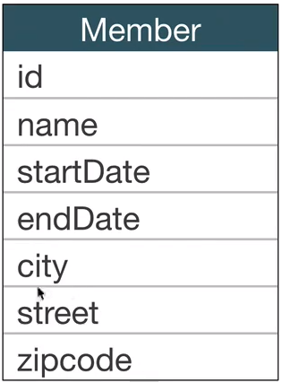
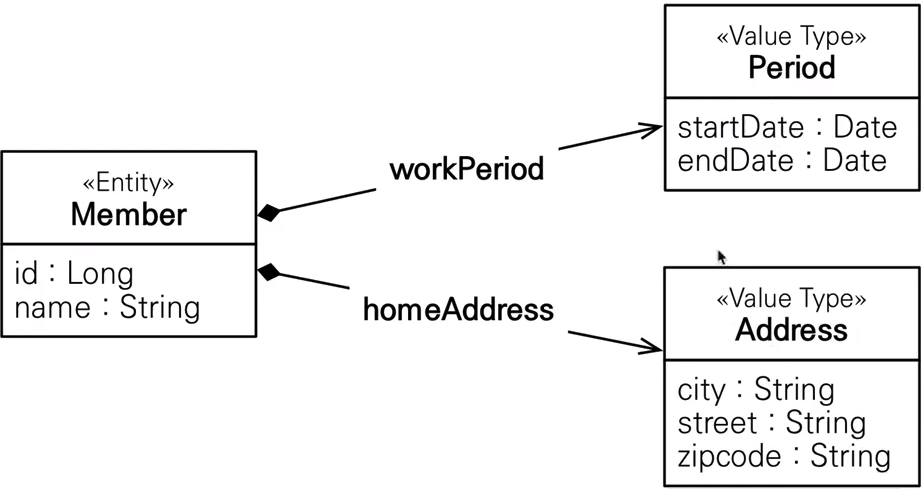
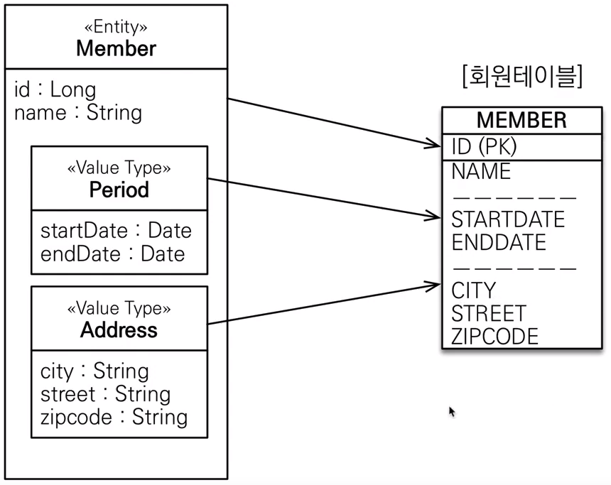
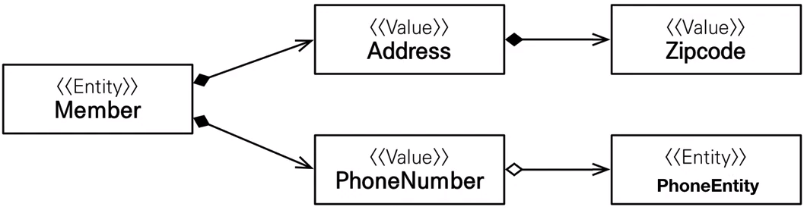
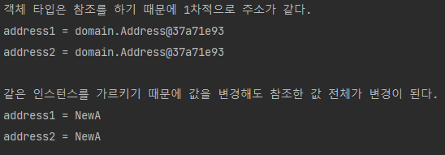

# JPA의 데이터 타입 분류
* 엔티티 타입


* 값 타입
  * [기본값 타입(`Primative Type`)](#기본값_타입)
  * [임베디드 타입(`Imbedded Type`)](#임베디드_타입)

***

## 엔티티 타입

* `@Entity`로 정의하는 객체
* 데이터가 변해도 `식별자`로 지속해서 추적 가능
    * ex: 회원 엔티티의 키나, 나이값(속성)을 변경해도 `식별자`로 인식이 가능함.
  
***

## 값 타입
* `int, Integer`, `String`처럼 단순히 값으로 사용하는 자바 기본 타입이나 객체.
* `식별자`가 없고 값만 있으므로 변경시 **추적 불가.**
    * ex: 숫자 100을 200으로 변경하면 완전히 다른 값으로 대체
<br></br>
* 값 타입에는 `기본값 타입`, `임베디드 타입`, `컬렉션 값 타입`이 있다.
<br></br>
  
## 기본값 타입
* 종류
    * 자바 기본 타입 (`int`, `double`)
    * Refer 클래스 (`Integer`, `Long`)
    * String
    
* 생명주기를 엔티티에 의존
    * ex: 회원을 삭제하면 이름, 나이 필드도 함께 삭제
    
* **값 타입은 공유하면 안된다!**
  * 이미 자바에서 안전하게 사용이 가능하게끔 설계가 되어 있음.
  * ex: 회원 이름을 변경 시 다른 회원의 이름도 함께 변경되면 안됨.
  * `자바 기본 타입`은 값을 절대 공유하지 않고 항상 값을 복사함.
  * `Refer`나 `String`같은 `클래스`는 공유 가능한 객체이지만 변경을 불가능게 만들어 안전하게 사용이 가능.


## 임베디드 타입
* 새로운 값 타입을 직접 정의할 수 있음.
* 주로 기본 값 타입을 모아 만들기 때문에 복합 값 타입이라고 함.
* `int`, `String`과 같은 값 타입. (추적이 안되기 때문에 주의해서 사용)


### 예시
* 회원 엔티티에서는 특히 `근무 시작일과 종료일`, `도시 주소, 번지 주소, 우편번호`를 가진다.  
  *   


* 각각 `근무기간`, `주소` 로 묶을 수는 없을까? => `임베디드 타입`을 통해 해결

  

### 장점
  * 재사용이 가능하다.
  * **응집도가 높아서** 해당 값 타입만사용하는 **의미 있는 메소드를 만들 수 있다.**
  * 임베디드 타입을 포함한 모든 값 타입은, **값 타입을 소유한 엔티티에 생명주기를 의존한다.**
  
  
### 사용법
  * 기본 생성자를 필수로 가지고 있어야 한다.
  * `@Embeddable` : 값 타입을 정의하는 곳에 표시
  * '@Embedded' : 값 타입을 사용하는 곳에 표시


### 임베디드 타입과 테이블 매핑

  * 임베디드 타입은 `엔티티의 값`일 뿐이다.
  * 임베디드 타입을 사용하기 전과 후에 **매핑하는 테이블은 같다.**
  * 객체와 테이블을 **아주 세밀하게 매핑하는 것이 가능하다.**
  * 그래서 잘 설계한 ORM 애플리케이션은 매핑한 테이블의 수보다 클래스의 수가 더 많다.

### 임베디드 타입과 연관관계


### 속성 재정의
* 한 엔티티에서 같은 값 타입을 사용하면?? (ex: 집주소와 직장 주소 둘다 `Address`사용)
* 컬럼 명이 중복된다.

### 주의사항
* 기본적으로 값타입은 객체를 조금이라도 `단순화`하려고 만든 개념이기 떄문에 `단순`하고 `안전`해야 한다.

### 값 타입을 여러 엔티티에서 공유하면 위험하다.
```java
       Address address = new Address("city", "street", "zipcode");
    
       Member member1 = new Member();
       member1.setName("member1");
       member1.setWorkAddress(address);
       member1.setPeriod(new Period());
       em.persist(member1);
    
       Member member2 = new Member();
       member2.setName("member2");
       member2.setWorkAddress(address);
       member2.setPeriod(new Period());
       em.persist(member2);
    
       //의도 : member1의 주소를 변경
       member1.getHomeAddress().setCity("newCity");
       tx.commit();
   ```
   * 의도는 member1의 주소만 변경이지만 보면 `member1`, `member2` **모두 주소가 변경이 된다.**


### 해결책 : 값을 복사해서 사용하자
  `Address copyAddress = new Address(address.getCIty(), address.getStreet(), address.getZipCode());`
  * 공유 참조로 인해 발생하는 부작용을 피할 수 있음.
  

### 문제점 (`valuetype.CopyTest.class` 참고)
  * **직접 정의한 값 타입은** 자바의 기본 타입(Primitive)이 아니라 `객체 타입(Objective)`이다.
    * `기본 타입`은 값을 할당하면 `복사`가 되서 넘어가기 떄문에 한번에 값들을 변경하는 것이 불가능함.
      ```java
      int a = 10;
      int b = a;
      b = 4;
      
      //결과
      a = 10   b = 4;
      ```
    * `객체 타입`은 참조 값을 직접 대입하는 것을 막을 방법이 없음. (컴파일단위에서 못막는다.)
      * 객체 타입은 `공유 참조`를 피할 수 없음
      ```java
        Address address1 = new Address("A", "B", "C");
        Address address2 = address1;

        System.out.println("객체 타입은 참조를 하기 때문에 1차적으로 주소가 같다.");
        System.out.println("address1 = " + address1);
        System.out.println("address2 = " + address2);
        System.out.println("");

        System.out.println("같은 인스턴스를 가르키기 때문에 값을 변경해도 참조한 값 전체가 변경이 된다.");
        address2.setCity("NewA");
        System.out.println("address1 = " + address1.getCity());
        System.out.println("address2 = " + address2.getCity());
      ```
      * 결과  
        
        
### 그렇다면..?
  * `불변객체`를 이용하자.
    * 불변객체? : **생성 시점 이후 절대 값을 변경할 수 없는 객체.**
    
  * 작동 원리 : `생성자`로만 값을 설정하고, `수정자`를 만들지 않는 이상 변경이 불가능.
  * 만약 수정을 하고 싶으면, 복사를 해서 수정을 하는 `copy`메서드를 따로 만들던가 해야 함.

***

### 값 타입 비교 (`valuetype.CompareValueType.class`)
```java
public class valuetype.CompareValueType {
    public static void main(String[] args) {

        int a = 10;
        int b = 10;

        System.out.println("기본 타입은 같다.");
        System.out.println("a == b : " + (a == b));

        Address address1 = new Address("city", "street", "zipcode");
        Address address2 = new Address("city", "street", "zipcode");

        System.out.println("레퍼런스 타입은 인스턴스 참조가 다르기 때문에 내용물이 똑같다 하더라도 다르다.");
        System.out.println("address1 == address2 : " + (address1 == address2));
    }
}
```
  ```
  결과
  기본 타입은 같다.
  a == b : true
  레퍼런스 타입은 인스턴스 참조가 다르기 때문에 다르다.
  address1 == address2 : false
  ```
* 이렇게 인스턴스가 다르면 안의 내용물이 똑같아도 다르다는 결과가 나온다. 하지만 인간은 내용물이 같으면 같다고 생각하는데 이 갭을 어떻게 해결할까?


* 동일성 vs 동등성
  * 동일성(Identity) : 인스턴스의 참조 값을 비교 `==` 사용
  * 동등성(Equivalence) : 인스턴스의 값을 비교 `equals()` 사용
  * **`값 타입`은 `동등성`을 비교 해주어야 하며, `equals()` 메소드를 상황에 맞게 `재정의(오버라이드)` 해주어야 함.** (모든 필드를 재정의 해야함.)
  

* 동등성 활용  
  * `System.out.println("address1 equals address2 : " + (address1.equals(address2)));`을 해도 결과는 `false`가 나온다.
  * `equals` 메소드를 재정의 하지 않았기 때문
  
  * `Address`의 `equals`와 `hashcode` 재정의
    ```java
      @Override
      public boolean equals(Object o) {
          if (this == o) return true;
          if (o == null || getClass() != o.getClass()) return false;
          Address address = (Address) o;
          return Objects.equals(city, address.city) && Objects.equals(street, address.street) && Objects.equals(zipCode, address.zipCode);
      }
  
      @Override
      public int hashCode() {
          return Objects.hash(city, street, zipCode);
      }
    ```
  * 그 후 다시한번 `equals`를 실행하면 `true` 결과가 나온다.
***

### 번외 : `@MapperSuperClass`와 `@Embeddable`의 차이
다중 매핑에서 공부했을 때 **상속**의 기능을 하는 `@MapperSuperClass`와 이번 **이임**의 기능을 하는 `@Embeddable`중 뭘 써야할지 생각해 보자.
* `@MapperSuplerClass`
  * **값 타입을 여러 엔티티에서 공유하면 위험**하다. `@MapperSuplerClass`를 사용하자. (값타입 주의사항 참고.)
  * ex: 데이터 생성 및 업데이트 시점, 생성한 및 업데이트한 사람 (`createdAt`, `createdBy`, 등등..)
  
* `@Embeddable`
  * 다중상속이 불가능한 자바이기 떄문에 대부분의 상황에서 `@Embeddable`가 유리
  * 상속은 유연성이 떨어지기 떄문에 객체지향적으로 설계를 하려면 `@Embeddable` 사용
  
*** 


