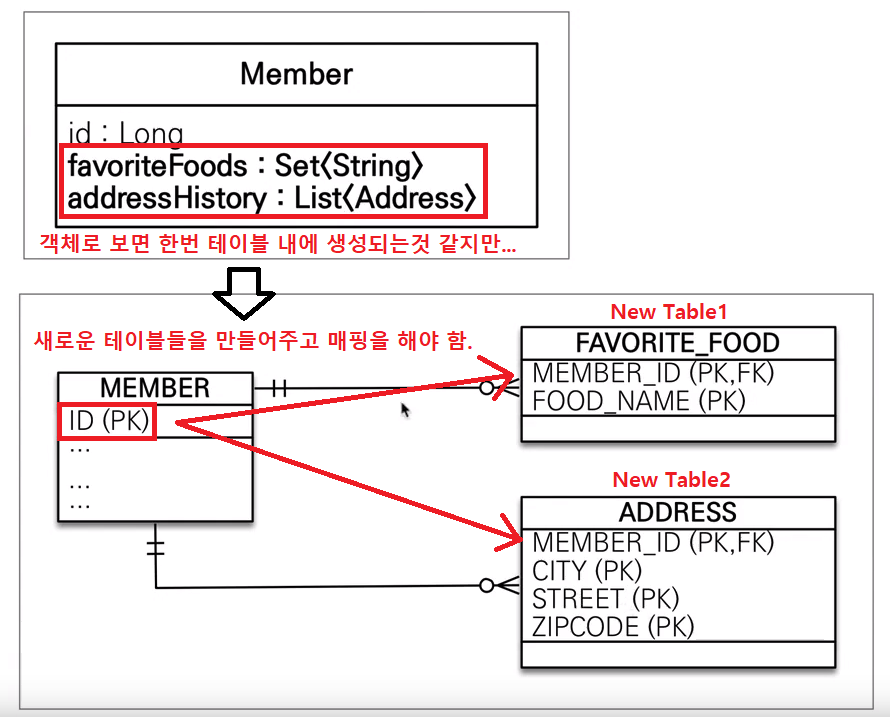
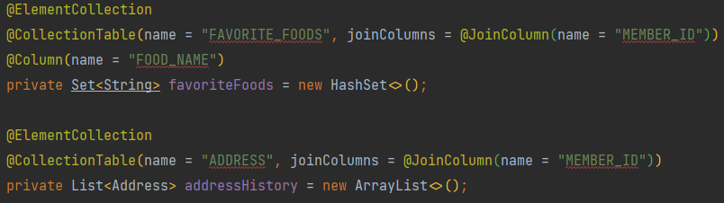
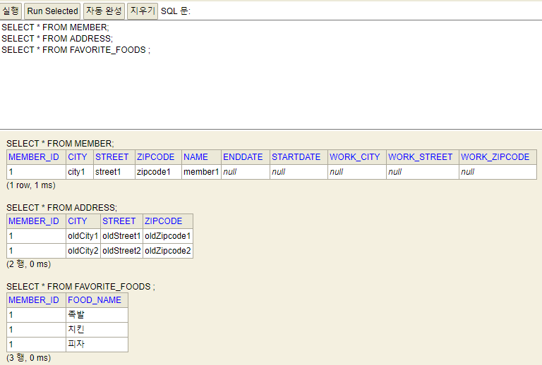
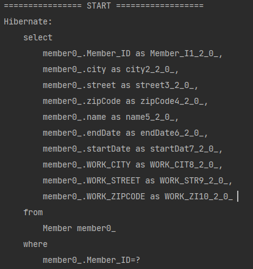
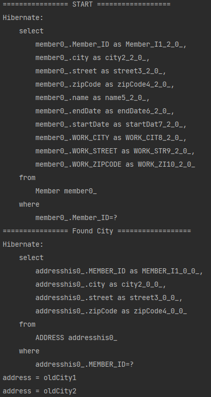
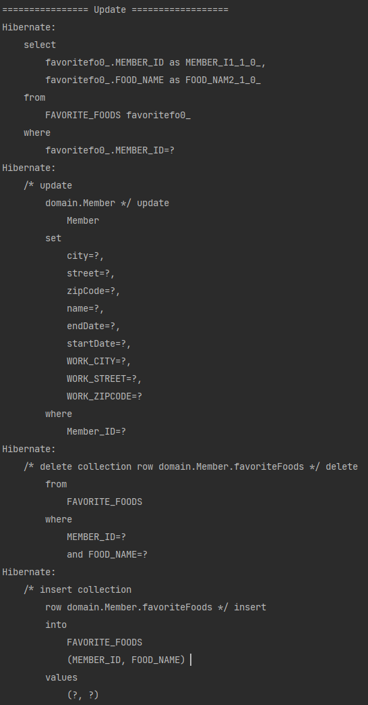
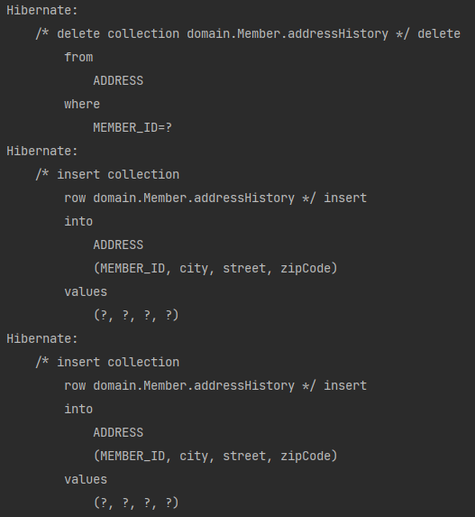

# 값 타입 컬렉션
말 그대로 `값 타입`을 `컬렉션`에 담아 쓰는 것을 말한다.

## 값 타입 컬렉션 추가하기.


* 일반적인 필드면 하나씩 추가하면 그만이나 이렇게 컬렉션 인터페이스의 경우에는 주의가 필요하다.
* 데이터베이스는 컬렉션을 같은 테이블에 저장할 수 없기 때문에 `일대다관계`의 설계와 같이 테이블을 따로 만들어주는 설계가 필요하다.


그렇다면 `Member`에 `favoriteFoods`와 `addressHistory`를 추가해 보자.  



* 설계를 위해 생성된 추가적인 엔티티들을 매핑할때 사용하는 어노테이션들은 다음과 같다.
    * `ElementCollection` : 값 타입 컬렉션이라 `매핑`할 때 사용.
    * `@CollectionTable` : 매핑 정보를 추가로 줄 때 사용
        * `name` : 이름 지정
        * `joinColumns` : 매핑할 PK를 지정. ( = PK를 외래키로 삼는다.)
    * `favoriteFoods`의 경우 값이 `String`타입 하나 이기때문에 예외적으로 `@Column`을 통해 이름 지정이 가능하다.
    * `addressHistory`의 경우에는 여러 값을 가지는 `Address` 타입이기 때문에 불가능.
    
이제 실행을 해보자.  

  
다음과 같이 `ADDRESS`와 `FAVORITE_FOODS` 테이블들이 만들어 진 것을 볼 수 있다.  

## 값 타입 컬렉션 저장

이제는 값들을 입력해 보자. (`CollectionMain`참고)
```java
Member member = new Member();
member.setName("member1");
member.setHomeAddress(new Address("city1", "street1", "zipcode1"));

member.getFavoriteFoods().add("치킨");
member.getFavoriteFoods().add("족발");
member.getFavoriteFoods().add("피자");

member.getAddressHistory().add(new Address("oldCity1", "oldStreet1", "oldZipcode1"));
member.getAddressHistory().add(new Address("oldCity2", "oldStreet2", "oldZipcode2"));

em.persist(member);
tx.commit();
```
* 결과를 보면 3개의 테이블들이 생성되는 것을 볼 수 있다.  

  
* 여기서 추가적으로 주목할 점은 `member` 하나만 `persist`했다는 점이다.  
    * `member`, `ADDRESS`, `FAVORITE_FOODS`들 모두 생명주기가 같이 돌아감.
        * 이는 값 타입의 특징이다. (값 타입은 생명주기가 따로 없기때문에 엔티티에 의존한다.)<br></br>
    * `영속성 전이` + `고아 객체 제거` 기능을 필수로 가진다.
    
## 값 타입 컬렉션 조회
이번에는 조회를 해보자. `CollectionMain`에서 다음 코드만 추가를 하자.
```java
em.flush();
em.clear();

System.out.println("================ START ==================");
Member findMember = em.find(Member.class, member.getId());

tx.commit();
```
* 결과  
  

여기서 알 수 있는점은 우리가 `Member`에 대해서 조회를 했을 때 `join` 없이 순수하게 `member`만 딸려왔다는 점이다.  
이는 우리가 저번 장에서 배웠던 `지연로딩` 전략을 사용한다는 것을 알 수 있다.  
  
추가적으로 `CollectionMain`에서 `Address`의 `city`를 검색해 보자.
```java
...
System.out.println("================ START ==================");
Member findMember = em.find(Member.class, member.getId());

System.out.println("================ Found City ==================");
List<Address> addressHistory = findMember.getAddressHistory();
for (Address address : addressHistory) {
    System.out.println("address = " + address.getCity());
}

tx.commit();
```

* 결과  
  
확실히 지연로딩 전략을 사용하는 것이 보인다.

## 값 타입 컬렉션 수정
* 값타입은 불변객체로 만들어야 한다. 그렇기 때문에 업데이트 시 새로 만들어서 교체를 해 주어야 한다.
* `FavoriteFoods` 같은 경우 `단순 String`타입 이기 때문에 업데이트가 불가능하다. 삭제후에 새로 추가를 하자.
```java
...
System.out.println("================ Update ==================");
// 수정시 값타입은 set 사용 없이 새로 만들어서 교체해야 한다.Address a = findMember.getHomeAddress();
findMember.setHomeAddress(new Address("newCity1", "newStreet1", "newZipCode1"));

// 치킨 -> 한식 (단순 String은 업데이트가 불가능하기 때문에 삭제 + 추가)
findMember.getFavoriteFoods().remove("치킨");
findMember.getFavoriteFoods().add("한식");

```

* 결과  
  
* 영속성 전이가 되는것 처럼 `치킨`이라는 값만 넣어줘도 테이블에서 찾아서 삭제해주는 쿼리를 날린다.
* `Collection`을 다룰 때 `remove` 메소드를 보면 `equals`를 이용해서 값을 삭제하는 것을 볼 수 있다.  
  그렇기 때문에 재정의를 하는것이 정말 중요하다!
  
## 값 타입 컬렉션의 제약사항
* 값 타입은 `식별자` 개념이 없기 떄문에 변경 시 추적이 어렵다.
* 값 타입 컬렉션에 변경 사항이 발생하면, `주인 엔티티`와 연관된 모든 데이터를 삭제하고,   
  값 타입 컬렉션에 있는 현재 값을 모두 다시 저장한다.
  * `CollectionMain`에 다음 코드를 작성해 실행해보자.
    ```java
    // Collection을 다룰 때 equals와 hashcode 재정의를 주의하자
    findMember.getAddressHistory().remove(new Address("oldCity1", "oldStreet1", "oldZipcode1"));
    findMember.getAddressHistory().add(new Address("newCity1", "newStreet1", "newZipCode1"));
    ```
    
      
  * `addressHistory` 테이블을 모두 삭제하고 현재값들을 각각 입력하는 것을 볼 수 있다.
    * 상당히 비효율적이므로 사용 권장을 하지 않음. (추적 불가)
    
* 값 타입 컬렉션을 매핑하는 테이블은 모든 컬럼을 묶어서 기본 키를 구성해야 한다. (`Null 입력 불가`, `중복저장 불가`)

## 정리
* 실무에서는 상황에 따라 값 타입 컬렉션 대신 `일대다 관계`를 고려.
* 일대다 관계를 위한 엔티티를 만들고, 여기에서 값 타입을 사용
* `값 타입 컬렉션`의 이점은 `영속성 전이` + `고아 객체 제거`를 사용하면 커버가 충분히 가능하다.
  * addressHistory 대체 (`AddressEntity`)
    ```java
    @OneToMany(cascade = CascadeType.ALL, orphanRemoval = true)
    @JoinColumn(name = "MEMBER_ID")
    private List<AddressEntity> addressHistory = new ArrayList<>();
    ```
    
* 정말 단순하게 설계를 할 때만 `값 타입 컬렉션`을 사용하자.
* 엔티티와 값 타입을 혼동해서 엔티티를 값 타입으로 만들면 안된다.
  

### 결론 : `식별자가 필요`하고, `지속해서 값을 추적`해야 하며, `변경 가능성이 있다`면 값타입이 아닌 `엔티티`를 사용해야 한다!