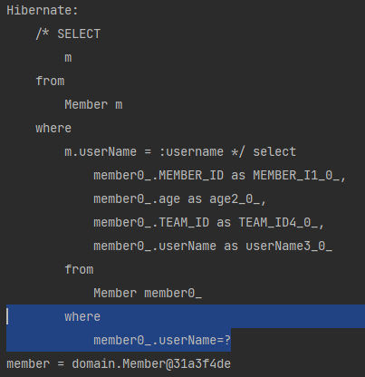

# JPQL
* 엔티티 객체를 대상으로 쿼리
* JPQL은 SQL을 `추상화`해서 특정 데이터베이스 SQL에 의존하지 않는다. (DB방언)

# JPQL 기본문법
```sql
SELECT _문 :: =
    select ? from ? 
    [where]
    [groupby]
    [having]
    [orderby]
    
// 한번에 여러개를 업데이트 할 떄
update _문 :: = update ? [where_절]
delete _문 :: = delete ? [where_절]
```

* `엔티티`와 `속성`은 **대소문자 구분을 한다.** (Member, age)
* `JPQL 키워드`는 **대소문자 구분을 하지 않는다.** (`SELECT or select` `From or from`, `WHERE or where` 다 가능)
* 대상을 지정할때 테이블 이름이 아닌 `엔티티 이름`을 지정해야 한다.
* **`별칭` 은 필수(m)** (as는 생략이 가능.)
    `select m from Member as m where m.age > 18`
  
## 집합과 정렬

* 그룹 함수
    ```sql
    SELECT
        count(m),   // 회원 수
        sum(m.age), // 나이 합
        avg(m.age), // 평균 나이
        max(m.age), // 최대 나이
        min(m.age)  // 최소 나이
    from Member m
    ```
* `GROUP BY` : 그룹 함수를 `GROUP BY`절에 지정된 컬럼의 값이 같은 행에 대해서 통계 정보를 계산.
* `HAVING` : `WHERE`과 기능은 동일하나 그룹 함수를 포함하는 것만을 다룸.
* `ORDER BY` : `정렬`할때 쓰임

    ```sql
    SELECT [DISTINCT] 컬럼, 그룹 함수(컬럼)
    FROM 테이블명
    [WHERE 조건]
    [GROUP BY Group대상]
    [HAVING 그룹 함수 포함 조건]
    [ORDER BY 정렬대상 [ASC/DESC]]
    ```
  
## TYPEQuery, Query
* `TYPEQuery` : 반환 타입이 명확할 때 사용
    * `TypedQuery<Member> query = em.createQuery("SELECT m FROM Member m", Member.class);`
<br></br>
* `Query` :  반환 타입이 명확하지 않을 때 사용 (여러 타입의 데이터를 가져올 때)
    * `Query<Member> query = em.createQuery("SELECT m.username, m.age FROM Member m", Member.class);`
        * `String 타입의 username`과 `int 타입의 age`를 가져오기 때문에 반환 타입이 명확하지 않다.

## 결과 조회 API
* `ResultMain.class` 참고<br></br>
* `query.getResultList()` : 결과가 `Collection`일 경우 (= 결과가 하나 이상일 때) 리스트로 반환.
    * 결과가 없는 경우 빈 리스트로 반환. (`NullPointException`에 대해 고려를 안해도 된다.)
<br></br>
* `query.getSingleResult()` : **결과가 반드시 하나인 경우**, `단일 객체` 반환.
    * 결과가 없으면 :`javax.persistence.NoResultException` 반환
    * 결과가 여러개면 : `javax.persistence.NoUniqueResultException`
    
## 파라미터 바인딩
* `BindingMain.class` 참고<br></br>
* 이름 기준
    ```jpaql
    query = em.createQuery("select m from Member m where m.username =:username", Member.class)
    query.setParameter("username", "member1");
    ```
    * 결과  
    
<br></br>
* 위치 기준
    * 밀어쓰기 가능성이 있기 때문에 권장하는 방법은 아니다. 왠만하면 `이름 기준`을 사용하자.
```jpaql
query = em.createQuery("select m from Member m where m.username =?1", Member.class)
query.setParameter(1, "member1");
```