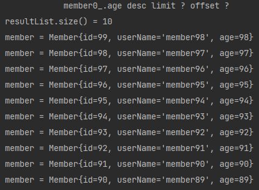

# 프로젝션
`ProjectionMain.class` 참고. <br></br>
* SELECT 절에 조회할 대상을 지정하는 것.
* 프로젝션 대상 : `엔티티`, `임베디드 타입`, `스칼라 타입(= 숫자, 문자 등 기본데이터 타입)`<br></br>
    * SELECT `m` From Member m -> `엔티티` 프로젝션 <br></br>
    * SELECT `m.team` From Member m -> `엔티티` 프로젝션 <br></br>
    * SELECT `m.address` FROM Member m -> `임베디드 타입` 프로젝션
      * 임베디드 타입은 시작하는 엔티티를 정해주어야 함. (ex: `m.address or o.address`) <br></br>
    * SELECT `m.username, m.age` FROM Member m -> `스칼라 타입` 프로젝션 <br></br>
    * 앞에 DISTINCT를 넣으면 중복제거 가능 (조건이 다 똑같을 때 사용)
    

* 참고 : 엔티티 프로젝션은 결과들이 영속성 컨텍스트에 반영이 된다.

## 여러 값 조회
`ProjectionMain2.class` 참고. <br></br>
[SELECT `m.username, m.age` FROM Member m] 와 같이 `여러 타입`의 값을 조회하는 경우 사용하는 방법은 다음과 같다.

1. Query 타입으로 조회  
   * 02.기본문법에서 [TYPEQuery, Query](02-기본문법.MD) 참고
2. Object[] 타입으로 조회
   ```jpaql
   List resultList = em.createQuery("SELECT m.age, m.userName from Member m")
            .getResultList();

   Object o = resultList.get(0);
   Object[] result = (Object[]) o;
   System.out.println("username = " + result[0]);
   System.out.println("age = " + result[1]);
    ```
3. new 명령어로 조회
    * 단순 값을 DTO로 바로 조회
        `SELECT new domain.MemberDTO(m.userName, m.age) from Member m`
    * 패키지 명을 포함한 전체 클래스 명 입력 (`domain.MemberDTO`)
    * 순서와 타입이 일치하는 생성자 필요
    
    ```jpaql
    List<MemberDTO> newResultList = em.createQuery("SELECT new domain.MemberDTO(m.userName, m.age) from Member m",MemberDTO.class)
            .getResultList();
    MemberDTO memberDTO = newResultList.get(0);
    System.out.println("name = " + memberDTO.getUserName());
    System.out.println("age = " + memberDTO.getAge());
    ```
   
# 페이징 API
`PagingMain.class` 참고. <br></br>
* JPA는 페이징을 다음 두 API로 추상화가 된다.

* `setFirstResult(int startPosition)` : 조회 시작 위치 (0부터 시작)
* `setMaxResult(int maxPosition)`     : 조회할 데이터 수
<br></br>
* 예시
    ```jpaql
    List<Member> resultList = em.createQuery("select m from Member m order by m.age desc ", Member.class)
               .setFirstResult(1)
               .setMaxResults(10)
               .getResultList();
    
    System.out.println("resultList.size() = " + resultList.size());
    for (Member member : resultList) {
         System.out.println("member = " + member);
    }
    ```
  
* 결과 (H2 방언 기준)  
