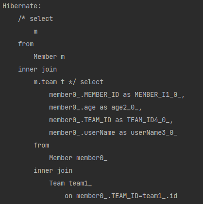
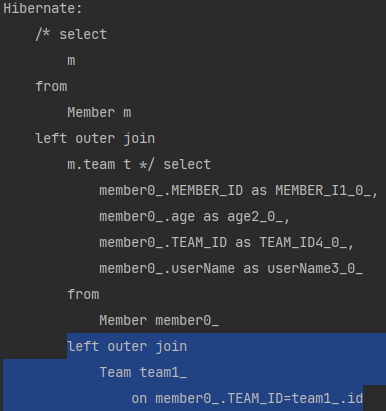

# 조인

## 목차
* [내부 조인](#내부-조인)

* [외부 조인](#외부-조인)

* [세타 조인](#세타-조인)

*** 

## 내부 조인
* 조인하는 테이블의 값이 누락이되면 전체가 누락이 된다.  

### 예시  
`SELECT m FROM Member m [INNER] JOIN m.team t`  
* `INNER`은 생략해도 된다.
* `Member`은 있으나 조인되는 `Team`이 없으면 데이터 전체가 조회되지 않는다.

### 결과  

***

## 외부 조인
* 조인하는 테이블의 값이 누락이되면 `Null`로 대체되어 조회가 된다.

### 예시  
`SELECT m FROM Member m LEFT [OUTER] JOIN m.team t`
* `OUTER`은 생략해도 된다.
* `Member`은 있으나 조인되는 `Team`이 없으면 `Team` 값들이 `Null`로 표시가 되고 조회가 된다.

### 결과  

***

## 세타 조인
* 아무 연관관계가 없는 요소들을 조인하는 경우에 사용  

### 예시
`select count(m) from Member m, Team t where m.userName = t.name`

### 결과  

***

## ON_절 을 활용한 조인
* 조인 대상을 필터링 할 수 있다.
* 연관관계가 없는 엔티티 외부 조인 (하이버네이트 5.1부터 가능해짐.)

### 필터링 예시  
`회원과 팀을 조인하면서, 팀 이름이 A인 팀만 조인`  
`ON_절` 뒤에서 조건을 명시해주면 된다.
* JPQL : [SELECT m, t FROM Member m LEFT JOIN m.team t `on t.name = 'A'`]  
* 실행 SQL : [SELECT m.*, t.* FROM Member m LEFT JOIN Team t `on m.TEAM_ID = t.id and t.name = 'A'`] 
    * `m.TEAM_ID=t.id` : `PK`와 `FK` 조인
    * `t.name = 'A'` : 추가적인 필터링
    
### 외부 조인 예시
`회원의 이름과 팀의 이름이 같은 대상 외부 조인`  
`ON_절` 뒤에서 조건을 명시해주면 된다.
* JPQL : [SELECT m, t FROM Member m LEFT JOIN Team t `on m.username = t.name`]
* 실행 SQL : [SELECT m.*, t.* FROM Member m LEFT JOIN Team t `on m.username = t.name`]
    * `Team t` : 연관관계가 없기 때문에 `m.team t`이 아닌 `Team t`으로 선언