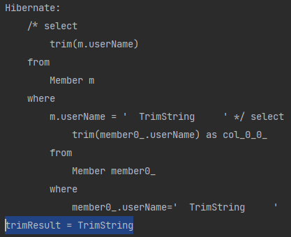
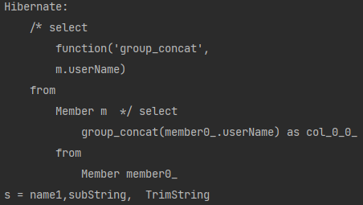

# JPQL 함수
* 정말 기본
    * JAVA의 문자열의 INDEX는 0부터 시작이나 SQL 문자열의 INDEX은 1부터 시작
    * 
## 목차

* JPQL 기본 함수
<br></br>
    * CONCAT 
      <br></br>
      
    * SUBSTRING 
      <br></br>
      
    * TRIM
      <br></br>
      
    * LOWER, UPPER
      <br></br>
      
    * LENGTH 
      <br></br>
      
    * LOCATE 
      <br></br>
      
    * ABS, SQRT, MOD 
      <br></br>
      
    * SIZE, INDEX(JPA 용도) 
      <br></br>
      
* 사용자 정의 함수 호출
  

## JPQL 기본 함수
기본 스펙 함수들이기 때문에 DB의 종류에 상관없이 사용하면 된다.

### CONCAT
* concat('a', 'b') : `a`와 `b` 문자열 합치기  

예시 : 문자 `a`와 `b`를 합쳐 Member 데이터 개수만큼 출력  
`String query = "select concat('a', 'b') from Member m";`  
`String query = "select 'a' || 'b' from Member m";`와 같다.


### SUBSTRING
* substring('word', pos, len) : `word` 문자열을 `pos`번째 위치에서 `len`개 문자를 읽어 들인다.  

예시 : 유저의 이름을 `2`번째 위치부터 `3`개 문자를 읽음.  
    ```jpaql
    String subStringQuery = "select substring(m.userName, 2, 3) from Member m where m.userName = 'subString'";
    Object subStringResult = em.createQuery(subStringQuery).getSingleResult();
    System.out.println("subStringResult = " + subStringResult);
    ```
  <br>
* 결과  
  
  

### TRIM
* 문자열의 `양쪽 공백`을 제거  

예시 : `'  TrimString     '`의 `양측 공백 제거`   
    ```jpaql
    String trimQuery = "select trim(m.userName) from Member m where m.userName = '  TrimString     '";
    Object trimResult = em.createQuery(trimQuery).getSingleResult();
    System.out.println("trimResult = " + trimResult);
    ```
  <br>
* 결과  
  
  

### LOWER, UPPER
* `LOWER` : 대문자를 소문자로 치환  
* `UPPER` : 소문자를 대문자로 치환  

예시 : `DO_LOWER`을 `소문자`로 치환.  
```jpaql
select lower('DO_LOWER') from Member;  
```
`결과 = do_lower`


### LENGTH
* 문자열의 길이를 조회  

예시 : `subString`의 문자열 길이를 출력.  
```jpaql
select length(m.userName) from Member m where m.userName = 'subString'
```
`결과 = 9`


### LOCATE
* LOCATE('Found String', 'String') : `String` 문자열 중 해당하는 문자의 최초 인덱스 출력

예시 : `abcdefg` 중 `de`가 있는 최초 인덱스
```jpaql
select locate('de', 'abcdefg') from Member m
```
`결과 = 4`


### ABS, SQRT, MOD


### SIZE, INDEX


***
## 사용자 정의 함수 호출
* 하이버네이트는 사용전 **방언에 함수를 추가해야 한다.**
    * 사용하는 DB방언을 상속받고, 사용자 정의 함수를 등록하자

### `H2 방언`을 추가해보자
1. `dialect` 패키지 생성
2. 사용하는 DB에 알맞게 클래스 생성 후 `해당 방언 상속`
3. `생성자`에서 등록.
    * 굳이 외우기보다 각 방언들의 소스코드를 보고 알맞게 추가하자.
    ```java
    public class MyH2Dialect extends H2Dialect {
    
        public MyH2Dialect() {
            registerFunction("group_concat", new StandardSQLFunction("group_concat", StandardBasicTypes.STRING));
        }
    }
    ``` 

4. `persistence.xml`에서 방언 등록  
    ```xml
    <property name="hibernate.dialect" value="org.hibernate.dialect.H2Dialect"/>
    ```
기존에 등록된 방언을..  
```xml
   <property name="hibernate.dialect" value="dialect.MyH2Dialect"/>
```
새로운 사용자 설정이 된 방언으로 등록하자.

### 사용
#### JPA 버전
```jpaql
select function('group_concat', m.userName) from Member m
```

#### 하이버네이트 버전
```jpaql
select group_concat(m.userName) from Member m
```

#### 결과  
  
  
* 성공적으로 등록이 된 것을 알 수 있다.