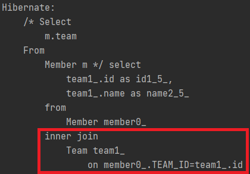
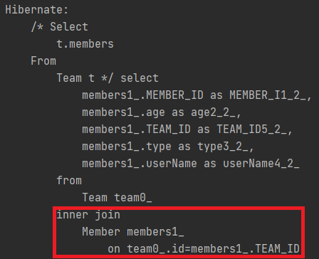

# 경로 표현식

## 경로 표현식 용어 정리
* `.`을 찍어 객체 그래프를 탐색하는 것.
    ```sql
    select m.userName       -> 상태필드
        from Member m
          join m.team t     -> 단일 값 연관 필드
          join m.orders o   -> 컬렉션 값 연관 필드
    where t.name = '팀A'
    ```
* 상태필드 : 단순히 값을 저장하기 위한 필드 <br></br>
* 연관 필드 : 연관관계를 위한 필드
    * 단일 값 연관 필드 : `@ManyToOne` `@OneToOne`인 관계를 가지는 엔티티 (ex: m.team)
        ```java
        @ManyToOne(fetch = FetchType.LAZY)
        @JoinColumn(name = "TEAM_ID")
        private Team team;
        ```
    * 컬렉션 값 연관 필드 : `@OneToMany`, `@ManyToMany`인 관계를 가지는 컬렉션 (ex: m.orders)
        ```java
        @OneToMany(mappedBy = "member")
        private List<Order> orderList = new ArrayList<>();
        ```
      
* 명시적 조인
    * `Join` 키워드를 직접 사용한 조인 <br></br>
* 묵시적 조인
    * 경로 표현식에 의해 묵시적으로 SQL 조인 발생 (`내부 조인`만 가능)
    * 권장하지 않는 방법(`SQL 튜닝이 어려움`, `DB에 일어나는 상황을 한눈에 파악하기 어려움.`)
      
## 경로 표현식 특징

### 1. 상태필드 
  * 경로 탐색의 끝 : 디렉토리의 끝, `.`을 더 붙여 경로를 이어나갈 수 없는 상태. **자연스럽게 탐색도 불가능하다.**
    * ex: `m.userName`은 뒤에 경로를 더 붙일 수 없다. `StateField.java` 참고
<br></br>
      

### 2. 단일 값 연관 경로
* 묵시적 내부 조인(inner join)발생 : 연관관계가 있는 엔티티를 다룰때 `Join`을 사용하지 않아도 JPA가 `내부 조인`을 사용한다.
  * 성능 튜닝이 어렵다. => `묵시적 내부 조인`을 최대한 피하자. <br></br>
    #### 예시 : `SingleValuePath.java` 참고
    `Member`가 `@ManyToOne`으로 연관관계가 설정된 `team` 엔티티를 다룰 때 `내부 조인`이 발생.
    ```java
    String singleValueQuery = "Select m.team From Member m";
    List resultList = em.createQuery(singleValueQuery).getResultList();
    ```
    * 결과  
       <br></br>
      
* 탐색을 계속 할 수 있다. : 다루고 싶은 엔티티 뿐 아니라 그 엔티티가 가지고 있는 필드를 또 탐색이 가능하다.
  #### 예시 : `SingleValuePath.java` 참고
  `team` 엔티티만 다룰 뿐 아니라 `team` 엔티티가 가지고 있는 추가적인 `name` 필드도 가져올 수 있다.
  ```java
  String singleValueQuery = "Select m.team.name From Member m";
  List resultList = em.createQuery(singleValueQuery).getResultList();
    ```
  

### 3. 컬렉션 값 연관 경로
* 묵시적 내부 조인(inner join)발생 : 마찬가지로 `내부 조인`을 사용. => `성능 최적화`에 주의하자.
  #### 예시 : `CollectionValuePath.java` 참고
  `Team`이 `@OneToMany`으로 연관관계가 설정된 `members` 엔티티를 다룰 때 `내부 조인`이 발생.
  ```java
  String collectionValueQuery = "Select t.members from Team t";
  List resultList = em.createQuery(singleValueQuery).getResultList();
  ```
  * 결과  
     <br></br>
    
* **탐색을 할 수 없다.**
    * **`컬렉션` 자체를 가르키는 것이기 때문에 추가적인 필드 탐색들이 불가능하다.**
    * `FROM`절에서 `명시적 조인`을 통해서 탐색을 해야 한다. (`묵시적 조인`을 쓰지 말자.)
        * `"Select [mbs.userName] from Team t [join t.members mbs"];`
    
    