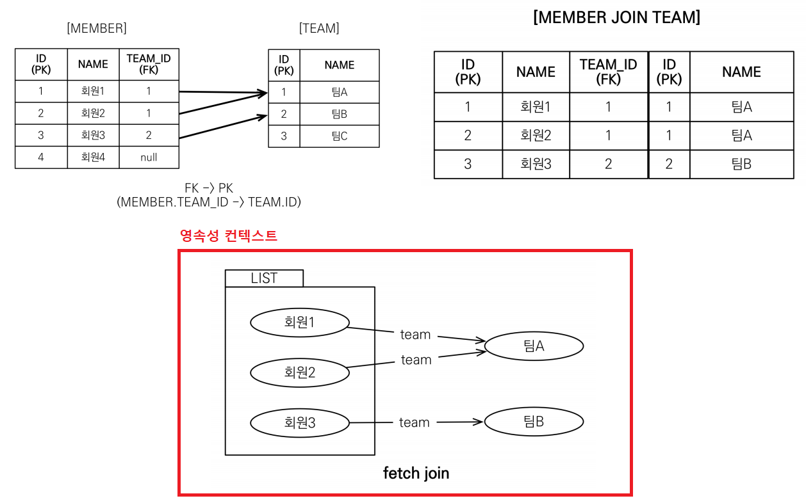
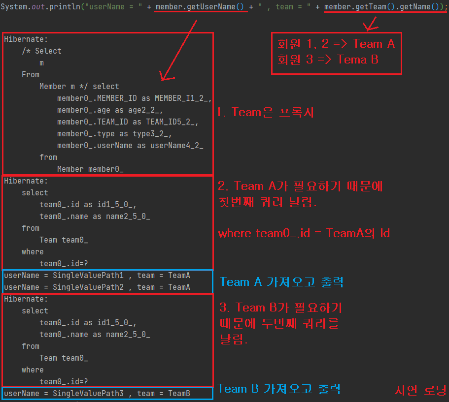
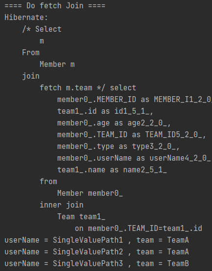
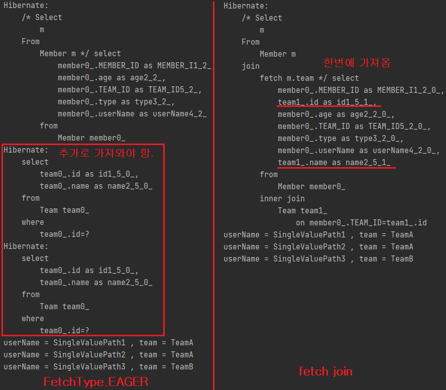
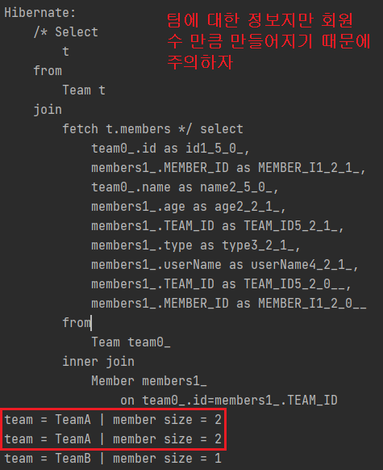
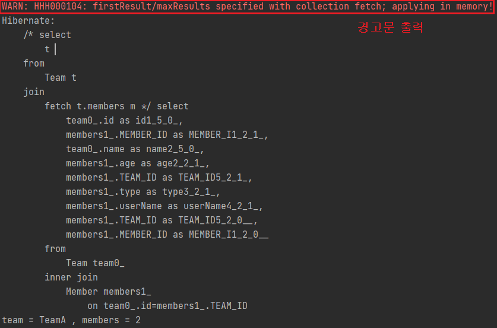

# Fetch Join
* SQL 조인 종류가 아닌 `JPQL`에서 `성능 최적화`를 위해 제공하는 기능.
* 연관된 엔티티나 컬렉션을 `객체 그래프를 SQL 한 번에 함께 조회`하는 기능.
* 일반 조인과 달리 `페치 조인`은 `연관된 엔티티`를 `함께 조회`함.
  * `JPQL`은 결과를 반환할 때 연관관계를 고려하지 않고, **SELECT 절에 지정한 엔티티만 조회**함.
* 페치 조인을 사용할 때만 연관된 엔티티도 함께 조회(`즉시 로딩`)
## 목차

* [엔티티 페치 조인](#엔티티-페치-조인)
* [컬렉션 페치 조인](#컬렉션-페치-조인)


## 엔티티 페치 조인
* 회원을 조회하면서 `연관된 팀`도 함께 조회(SQL 한 번에)
* SQL을 보면 회원 뿐 아니라 팀(`T.*`)도 함께 `SELECT` 쿼리가 날아감.
<br></br>
  예시 : 
  * JPQL
  ```jpaql
  select m from Member m [join fetch m.team]
  ```
  * SQL
  ```sql
  SELECT M.*, T.* FROM MEMBER M INNER JOIN TEAM T ON M.TEAN_ID = T.ID
  ```
  
### 예시


* 이 작업을 수행한다고 했을 때 `지연로딩이 적용된 일반적인 상황`과 `페치 조인이 적용된 상황`을 비교해 보자
* 쿼리문이 나가는 것을 비교하기 위해서 중간에 `em.clear()`을 실시하자.

#### 일반적인 상황
  ```java
  // 일반적인 지연로딩에서는 프록시를 가져왔다가 필요한 정보가 있을때 마다 DB에서 가져온다.
  String entityFetchJoinQuery = "Select m From Member m";
  List<Member> members = em.createQuery(entityFetchJoinQuery, Member.class).getResultList();
  for (Member member : members) {
      System.out.println("userName = " + member.getUserName() + " , team = " + member.getTeam().getName());
  }
  ```
  * 결과  
    
    
    * 영속성 컨텍스트에 프록시 상태로 있기 때문에 정보가 필요할 때 마다 계속 쿼리문을 날리는 것을 볼 수 있다.
    * `N + 1 문제`를 일으킬 수 있다.
  
#### 페치 조인 적용
  ```java
    String entityFetchJoinQuery2 = "Select m From Member m join fetch m.team";
    List<Member> members2 = em.createQuery(entityFetchJoinQuery2, Member.class).getResultList();

    for (Member member : members2) {
       System.out.println("userName = " + member.getUserName() + " , team = " + member.getTeam().getName());
    }
  ```
* 결과  
  
  
  * `한 쿼리`에 모든 정보를 가져온다.


#### 즉시로딩과 페치 조인의 차이점.

* `즉시 로딩`은 1차적으로 `Member`를 1차캐시로 가져오고 추가적으로 필요한 `Team`의 데이터들을 쿼리를 보내 가져옴.
* `페치 조인`은 `한 쿼리`에 모든 정보를 가져온다.


***


## 컬렉션 페치 조인
  * `일대다` 관계에서 사용하는 것을 `커렉션 페치 조인`이라 한다.
  ```java
  String collectionFetchJoinQuery = "Select t from Team t join fetch t.members";
  List<Team> members = em.createQuery(collectionFetchJoinQuery, Team.class).getResultList();
  
  for (Team team : members) {
      System.out.println("team = " + team.getName() + " | member size = " + team.getMembers().size());
  }
  ```
* 결과  
  

### 주의사항
* DB 입장에서 `일대다` 조인을 하면 DB가 뻥튀기가 된다.  
  
  
* 추가적인 확인을 위해 출력문을 다음 코드로 수정하자.
  ```java
  for (Team team : members) {
    System.out.println("team = " + team.getName() + " | member size = " + team.getMembers().size());
    for (Member member : team.getMembers()) {
        System.out.println(" - member = " + member);
    }
  }
  ```
  
* 결과
  ```
    team = TeamA | member size = 2
      - member = Member{id=4, userName='SingleValuePath1'}
      - member = Member{id=5, userName='SingleValuePath2'}
    team = TeamA | member size = 2
      - member = Member{id=4, userName='SingleValuePath1'}
      - member = Member{id=5, userName='SingleValuePath2'}
    team = TeamB | member size = 1
      - member = Member{id=6, userName='SingleValuePath3'}
  ```
  
### 중복 제거
이렇게 중복되는 데이터를 지우고 싶을때는 어떻게 할까? 바로 `DISTINCT`를 이용하면 된다. (`일대다`관계에서만 해당.)
* `SQL`의 `DISTINCT`는 중복된 결과를 제거하는 명령어다. <br></br>
  
* `JPQL`에서의 `DISTINCT`의 기능은 다음과 같다.
  * `SQL`에 `DISTINCT`를 추가.
  * `애플리케이션`에서 `같은 식별자를 가진 중복 엔티티` 제거
  
  
* `UseDistinct.java`에서 중복 제거하기  
  * `String distinctQuery = "Select [distinct] t from Team t join fetch t.members";` 처럼 `distinct`만 추가해주자

* 결과
  * 중복된 `TeamA`가 제거가 된 것을 볼 수 있다.
  ```
  team = TeamA | member size = 2
     - member = Member{id=4, userName='SingleValuePath1'}
     - member = Member{id=5, userName='SingleValuePath2'}
  team = TeamB | member size = 1
     - member = Member{id=6, userName='SingleValuePath3'}
  ```
  

## 페치 조인의 한계


### 페치 조인 대상에는 별칭을 줄 수 없다.
* `페치 조인`은 연관된 모든 데이터를 끌고오는 기능이다.
  * 중간에 필터링을 거쳐 선택적으로 가져올 수 없다.
<br></br>
* `하이버네이트`는 가능하나, 가급적 사용하지 말자 <br></br>
* 선택적으로 가져오고 싶으면 `별도의 쿼리를 이용`하자.

### 둘 이상의 컬렉션은 페치 조인 할 수 없다.
* 둘 이상의 컬렉션은 `일대다` X `일대다`의 크기를 가짐. => 예상치 못한 오류 발생

### 컬렉션을 페치 조인하면 페이징 API(`setFirstResult`, `setMaxResults`)를 사용할 수 없다.
* 일대일, 다대일 같은 `단일 값 연관 필드`들은 페치 조인해도 페이징 가능.
  * 데이터 뻥튀기가 되는 `N대다` 관계만 불가능.
  * `설정 페이징`이 데이터보다 작은 경우 데이터가 잘려서 나오기 때문에 불가능.
  

* 하이버네이트는 경고 로그를 남기고 `메모리에서 페이징` (매우 위험!!)
  * `메모리에서 페이징` = `모든 데이터`를 다 끌고와서 페이징을 한다.
  * 매우 위험함.

  


#### 해결책
  * `Join`의 방향을 뒤집기
  ```jpaql
  select t from Team t join fetch t.members m
  ```
  를 다음과 같이 변경하면 같은 결과를 얻을 수 있다.
  ```jpaql
  select m from Member m join fetch m.team t
  ```

  * `@BatchSize`를 대상 엔티티에 부여

    * `@BatchSize(size = )` : 해당 size 만큼 인쿼리로 미리 넘긴다.
    * `N+1` 문제 해결
    * 추가적으로 `persistence.xml`에서 `글로벌 세팅`으로 가져갈 수 있다.
  ```xml
  <property name="hibernate.default_batch_fetch_size" value="100" />    //1000 이하의 사이즈 권장.
  ```

  * DTO로 쿼리를 새롭게 짜기.
    * 굉장히 복잡한 일
  

## 정리
* 연관된 엔티티들을 SQL 한 번으로 조회 - 성능 최적화 <br></br>
* 엔티티에 직접 적용하는 글로벌 로딩 전략보다 우선적임
  * 글로벌 로딩 전략 : `@OneToMany(fetch = FetchType.Lazy)`
<br></br>
* 실무에서 글로벌 로딩 전략은 모두 지연 로딩<br></br>
* 최적화가 필요한 곳은 페치 조인 적용<br></br>

* 단 모든 것을 페치 조인으로 해결 할 수 없다.<br></br>
* 페치 조인은 객체 그래프를 유지할 때 사용하면 효과적<br></br>
* 여러 테이블을 조인해서 엔티티가 가진 모양이 아닌 전혀 다른 결과를 내야 한다면,  
  페치 조인보다는 일반 조인을 사용하고 `필요한 데이터들만 조회해서 DTO로 반환`하는 것이 효과적임.
  * 방법1: `페치조인`을 통해 엔티티를 조회해와서 그대로 사용
  * 방법2: `페치조인`을 통해 엔티티를 조회해와서 애플리케이션 단계에서 DTO로 변환
  * 방법3: `JPQL`을 짤때부터 `new Operation`을 통해 DTO로 변환해서 가져온다.