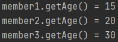
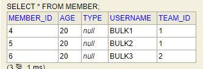

# 기타 기능
## 목차
* 다형성
  

* 엔티티 직접 사용


* Named 쿼리


* 벌크 연산

## 다형성

### type("부모 엔티티")
상속을 받는 경우 조회 대상을 `특정 자식으로 한정`할수 있다.
* 예시: `Product` 증 `Book`과 `Movie`를 조회해라.  
  [JPQL]
    ```jpaql
    select p from Product p
    where type(p) IN(Album , Book )    
    ```
  [SQL]
    ```sql
    select p.* from Product p
    where p.dtype in('A', 'B')
    ```
  
### TREAT
`다운 캐스팅` 기능을 가진다.
* 예시: 부모인 `Product`와 자식인 `Book`이 있다.  
  [JPQL]
    ```jpaql
    select p from Product p
    where treat(p as Book).author = 'kim'    
    ```
  [SQL]
    ```sql
    select p.* from Product p
    where p.dtype = 'A' and p.author = 'kim'
    ```
  

## 엔티티 직접 사용

### 기본 키 값
* `JPQL`에서 엔티티를 직접 사용하면 `SQL`에서 해당 엔티티의 `기본 키 값`을 사용
  [JPQL]
  ```jpaql
  select count(m.id) from Member m    // 엔티티의 아이디를 사용
  select count(m) from Member m       // 엔티티를 직접 사용
  ```
  [SQL]
  ```sql
  select count(m.id) as cnt from Member m // 둘다 같은 SQL문을 실행.
  ```

* 엔티티를 파라미터로 넘겨도 같은 결과가 나옴.  
  [Java]
  ```java
  String jpql = "select m from Member m where m =:member"
  List resultList = em.createQuery(jpql)
                      .setParameter("member", member 엔티티)
                      .getResultList();
  ```
  [Java]
  ```java
  String jpql = "select m from Member m where m.id =:memberId"
  List resultList = em.createQuery(jpql)
                      .setParameter("memberId", memberId값)
                      .getResultList();
  ```
  [SQL]
  ```sql
  select m.* from Member m where m.id = ?
  ```

### 외래 키 값
* 외래키 값 역시 마찬가지로 적용이 가능하다.  
  [Java]
  ```java
  String jpql = "select m from Member m where m.team =:team"
  List resultList = em.createQuery(jpql)
                      .setParameter("team", team 엔티티)
                      .getResultList();
  ```
  [Java]
  ```java
  String jpql = "select m from Member m where m.team.id =:teamId"
  List resultList = em.createQuery(jpql)
                      .setParameter("teamId", teamId값)
                      .getResultList();
  ```
  [SQL]
  ```sql
  select m.* from Member m where m.team.id = ?
  ```


## Named 쿼리
* 쿼리에 이름을 부여

### 예시  
1. 쿼리 이름 부여 (관례상 `엔티티명.쿼리이름` 형태로 부여함.)
    ```java
    @Entity
    @NamedQuery(
            name = "Member.findByUserName",
            query = "select m from Member m where m.userName = :userName")
    public class Member{
        ...
    }
    ```
   
2. 쿼리 이름을 이용해 사용
    ```java
    List<Member> resultList =
        em.createNamedQuery("Member.findByUsername", Member.class)
          .setParameter("userName", "회원1")
          .getResultList();
    ```
   
### 주의할점
* `정적 쿼리`만 가능하다
* `어노테이션`과 `XML`에 정의
* 애플리케이션 로딩 시점에 초기화 후 재사용
* 애플리케이션 로딩 시점에 쿼리를 검증


## 벌크 연산
* SQL문의 `UPDATE`문과 `DELETE`문을 `벌크 연산`이라 한다.
    * 특정 한건을 찍어서 `UPDATE`문과 `DELETE`문을 실행하는 것은 제외.
    
### 등장 배경

#### 목표 : 재고가 10개 미만인 모든 상품의 가격을 10% 상승시키자 
* `JPA 변경 감지 기능`으로 실행하려면 너무 많은 SQL문을 실행 해야 한다.
1. 재고가 10개 미만인 상품을 리스트로 `조회`
2. 상품 엔티티의 가격을 10% `증가`
3. 트랜잭션 커밋 시점에 `변경감지가 동작`.
<br></br>
   
이 작업이 실행되려면 100번의 UPDATE SQL이 실행되야 함. => 이를 해결하는 것이 `벌크 연산`.

[Java]
  ```java
  String jpql = "update Product p" +
                "set p.price = p.price * 1.1" +
                "where p.stockAmount <:stockAmount";

  List resultList = em.createQuery(jpql)
                      .setParameter("stockAmount", 10)
                      .excuteUpdate();
  ```

### 주의사항
* 벌크 연산은 `영속성 컨텍스트`를 무시하고 **데이터베이스에 직접 쿼리**

* 해결
    * 방법1: 벌크 연산을 먼저 실행
    * 방법2: `벌크 연산 수행` 후 `영속성 컨텍스트 초기화`.
    
```java
//JPQL 실행시점에 flush가 됨.
int resultCount = em.createQuery("update Member m set m.age = 20")
        .executeUpdate();

System.out.println("resultCount = " + resultCount);

System.out.println("member1.getAge() = " + member1.getAge());
System.out.println("member2.getAge() = " + member2.getAge());
System.out.println("member3.getAge() = " + member3.getAge());
```
* 이 결과를 수행하면 영속성 컨텍스트 내에 있는 데이터들은 모두 `UPDATE`가 완료가 된다. (JPQL 실행시점에 flush가 되기 때문.)
* 문제는 JPA 내에서는 데이터들이 `UPDATE`가 되지 않고 그대로 남아있다는 점이다.
<br></br>
    * `애플리케이션 내 데이터`  
    
      <br></br>
    * `DB에서의 데이터`  
    
  
* 이런 경우 영속성 컨텍스트를 초기화(`em.clear()`) 해주고 DB에서 새로 가져와야 한다.
```java
int resultCount = em.createQuery("update Member m set m.age = 20")
        .executeUpdate();

em.clear();
System.out.println("resultCount = " + resultCount);

Member findMember = em.find(Member.class, member1.getId())
System.out.println("findMember's Age = " + findMember.getAge())
```